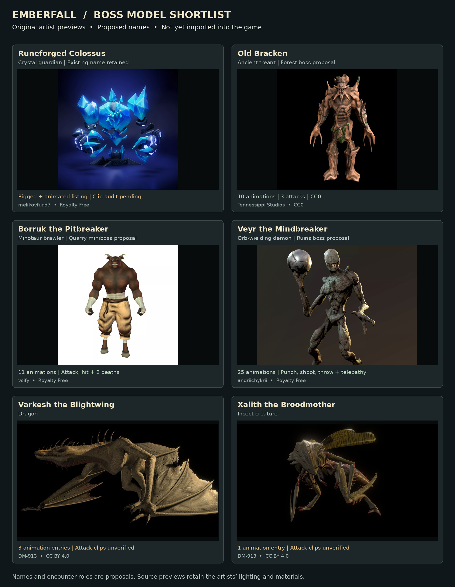

# Approved creature roster

On September 12, 2026, the owner approved the six model designs with two role changes: the treant formerly called Old Bracken becomes a standard **Forest Giant**, and the minotaur formerly called Borruk the Pitbreaker becomes a regular dungeon monster named **Ork**. The remaining four retain their selected boss names. All earlier draft boss names except **Runeforged Colossus** remain retired. The model selections, names and roles are approved. Forest Giants, Orks, the Colossus and Veyr now have inspected original assets and complete integrations. Xalith’s supplied original Blender rig is now integrated with authored game motions. The dragon remains pending in this checkout; the current status is in `lair-integration-checkpoint.md`.

## Approved regular monsters

| Game name | Actual model / artist | Included animation evidence | License |
| --- | --- | --- | --- |
| **Forest Giant** | [Free Treant Pack, Tree 02 — Tennessippi Studios](https://tennessippistudios.itch.io/treant-pack) | Ten listed animations, including three attacks, three deaths, idle, run, and taunt. The pack contains two distinct tree bodies. | CC0 |
| **Ork** | [Animated Minotaur — vsify](https://www.cgtrader.com/free-3d-models/character/fantasy-character/minotaur-cda47223-1a94-4f7d-bc2b-82344547726d) | Eleven listed animations including attack, hit, movement, shout, and two deaths. | CGTrader Royalty Free (no AI) |

Forest Giants populate forests. Orks populate dungeons. Both use the ordinary monster system, repeatable spawns, normal combat and ground drops. Neither has a named boss encounter, phase system, boss marks or boss music. Preserve the owner's spelling **Ork** in the game; the original asset title remains Animated Minotaur in the credits.

Both ordinary monsters have since been imported and verified in Emberfall. Their import audits record the original files, native motions and material handling.

## Approved bosses

The four bosses are **Runeforged Colossus**, **Veyr the Mindbreaker**, **Varkesh the Blightwing**, and **Xalith the Broodmother**. Design approval does not establish that their source animation clips have passed inspection. Only a few bosses should use phases or multiple attack styles.

### Veyr the Mindbreaker

[Demon Creature with Weapon — andriichykrii](https://www.cgtrader.com/free-3d-models/character/fantasy-character/demon-creature-with-weapon-25-animations-2-skins) has twenty-five listed animations plus a bonus A-pose, including punches, shooting, telepathy, throwing, damage and death. The animated FBX includes its orb weapon. Its CGTrader Royalty Free (no AI) license supports commercial game use under the terms below. The owner approved the darker demon design as a boss. Its ten reviewed runtime clips now drive melee and magic in the Shattered Sanctum. Below half health its second phase adds a telepathic ring and native jumping slam. The complete body, orb and source textures are recovered; see `veyr-integration.md`.

### Colossus: retain the name, use the owner's chosen asset

[Icebronze — melikovfuad7](https://www.cgtrader.com/free-3d-models/character/fantasy-character/icebronze) is free under CGTrader Royalty Free (no AI), and the listing marks it rigged and animated. Its description specifies 10,344 triangles but does not enumerate animation clips. The original files have since been recovered and imported. They contain only idle and anima, so all three styles share that native gesture with different game effects; no separate native style or death clips are claimed.

The owner's approved fight direction is stationary, with melee/ranged/magic styles and two phases. Proposed tuning: phase two begins at 50% health, turns the crystals and runes red, and shortens the attack cycle by 25% while retaining visible warnings. It remains anchored in the arena, can face the player, and cannot chase. Leaving its arena resets health, color, phase, and timing. These behaviors were implemented and published in version 55, with subsequent tutorial improvements in versions 56–57.

### Dragon pending; insect original inspected and integrated

| Approved name | Actual model / artist | Verified evidence | Remaining check |
| --- | --- | --- | --- |
| **Varkesh the Blightwing** | [Prowler Dragon Variant Rig — DM-913](https://sketchfab.com/3d-models/prowler-dragon-variant-rig-7ee71aaf323d426bbbdf28d73d55bbd9) | Original Blender rig; public Sketchfab metadata reports three animations, free download, CC BY 4.0. | Attack coverage is unverified. The artist notes that Blender bendy bones lose fidelity outside Blender; bake and inspect wing, tail, and neck deformation. |
| **Xalith the Broodmother** | [Insectoid Monster Rig — DM-913](https://sketchfab.com/3d-models/insectoid-monster-rig-01323e4b2563430f9da85cd255b6e176) | Original insectoid rig received from owner; CC BY 4.0. 13,156 triangles and two original actions inspected. | Original take is a landing/settling motion plus a static pose. Seven new Emberfall gameplay motions are built on the same rig; see `xalith-integration.md`. |

The owner approved these two designs as bosses. Attack and death coverage still need file inspection before integration. Their creator, model URLs, license, and modification notices must be credited if incorporated.

## Art review decisions

- The treant has carved bark, vines, recognizable hands, and a broad silhouette. The owner selected it for ordinary Forest Giants. The other body from the same pack is an available alternative.
- The minotaur has shaped anatomy, fabric, and hand wraps. The owner selected it for ordinary dungeon Orks.
- The orb demon has the strongest documented range of combat motions, with a distinct silhouette and its original weapon. Its darker horror design is approved for Veyr.
- The dragon and insectoid have detailed surfaces and strong creature silhouettes; required combat motion remains a gate.
- The Scarecrow Monster and Dorlak's Monster 4 were reviewed and set aside for this shortlist after viewing their art. The Yanez low-poly dragon was too simple for the requested detail. Regina Cachoa's European Dragon has five movement/idle animations listed but no attack. The deer monster advertises animation readiness without a clear action list. None of these is presented as a ready replacement.

## License and publication handling

[CGTrader terms](https://www.cgtrader.com/pages/terms-and-conditions), sections 21A and 21B, permit commercial game incorporation and require reasonable measures to prevent access to the original asset. Convert approved models to Emberfall's runtime representation; do not distribute the original FBX, Blender/Maya files, or source archives as public game assets. The no-AI restriction excludes model-training use.

[CC BY 4.0](https://creativecommons.org/licenses/by/4.0/) permits commercial adaptation with attribution and change notices. [CC0](https://creativecommons.org/publicdomain/zero/1.0/) permits commercial use without required attribution. Keep voluntary artist credits regardless.

Before importing: obtain the chosen source files through normal downloads or owner uploads, verify their rigs and actual action clips, preserve source licensing, and inspect actual game renders and weapon grips through motion. Only a few named encounters should have phases or multiple styles. Ordinary encounters stay simple. Misses and accurate zero-damage rolls must remain intact.

Before publication: integrate the approved models and update selected names consistently across encounter labels, ordinary monster definitions, quests, dialogue, and journals while preserving save IDs. Keep Forest Giant and Ork out of the boss roster, boss rewards and boss music triggers. Perform the integration checks already recorded in `combat-update-review.md`. The owner has already approved the designs and roles; do not ask for that same approval again. The current procedural meshes and superseded names must not be shipped as the accepted roster.

The machine-readable research and image provenance are in `boss-candidates/roster.json`. The board uses the original artists' still previews without changing the model designs or recoloring them. It is not an in-game screenshot.
